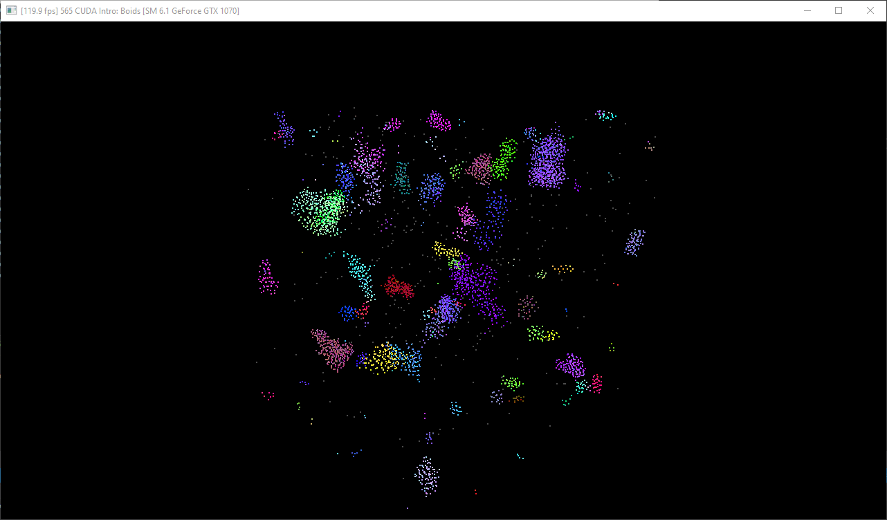
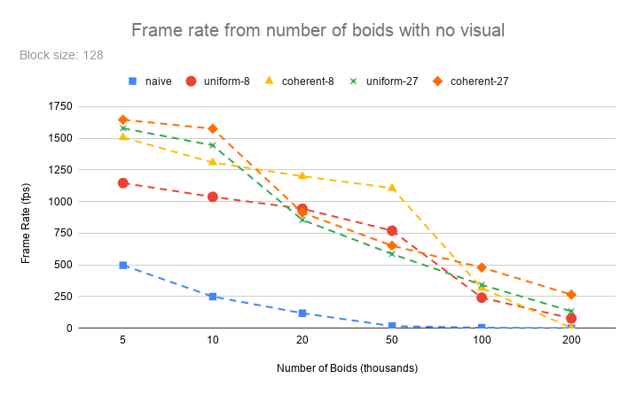
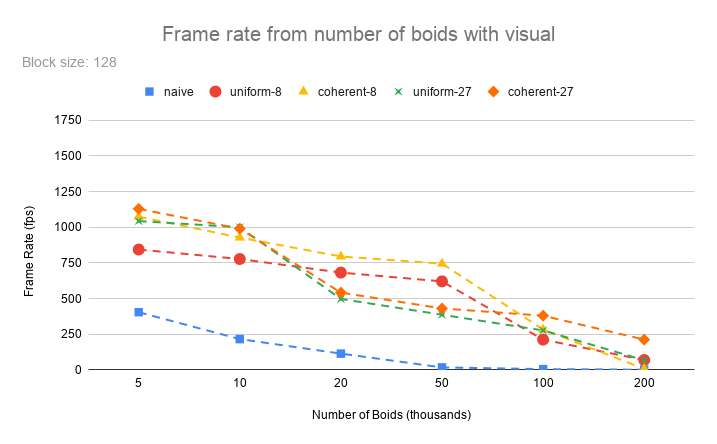
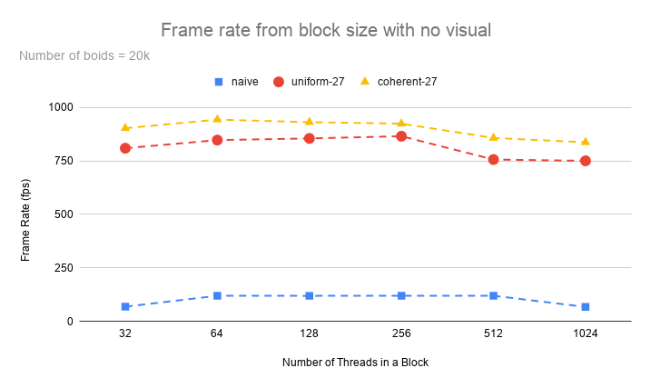
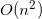
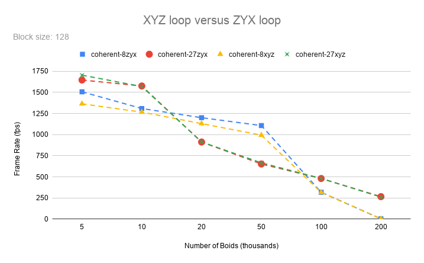
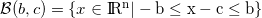
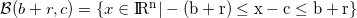
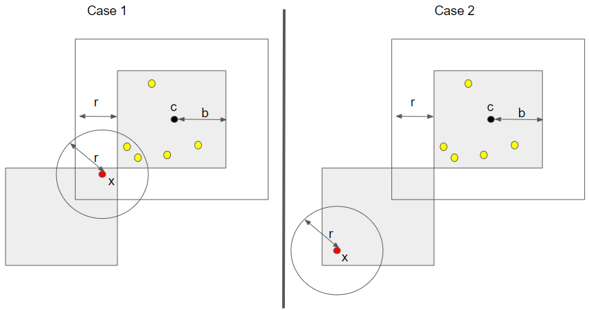
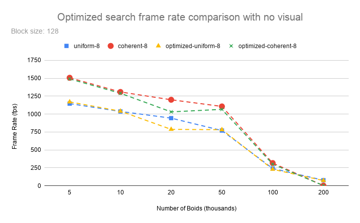

# Project 1 - Flocking

**University of Pennsylvania, CIS 565: GPU Programming and Architecture,
Project 1 - Flocking**

* Klayton Wittler
	* [LinkedIn](https://www.linkedin.com/in/klayton-wittler/)
* Tested on: Windows 10 Pro, i7-7700K @ 4.20GHz 16.0GB, GTX 1070 8.192GB (my PC)

## Sections

* [Introduction](#introduction-to-boid-flocking)
	* [Rules](#rules)
	* [Approaches](#approaches)
* [Performance Analaysis](#performance-analysis)
	* [Questions](#questions)
* [Addition Optimization](#additional-optimization)


# Introduction to Boid Flocking
This project implements Reynolds Boids algorithm using CUDA kernels along with several layers of neighbor search optimization: uniform grid and uniform grid with coherent memory access. 



## Rules
The algorithm follows three rules for simulating boid flocking

1. cohesion - boids move towards the perceived center of mass of their neighbors
2. separation - boids avoid getting to close to their neighbors
3. alignment - boids generally try to move with the same direction and speed as their neighbors

Psuedocode for the algorithm goes as follows.
```
function velocityChange(Boid boid)
	vector cohesive_velocity = 0
	vector avoidance_velocity = 0
    vector alignement_velocity = 0

    float cohesive_neighbors = 0
    float alignment_neighbors = 0

    for each Boid b to check
        if b != boid then
        	if distance(b, boid) < rule1Distance then
            	cohesive_velocity += b.position
            	++cohesive_neighbors
        	end
        	if distance(b, boid) < rule2Distance then
            	avoidance_velocity += (boid.position - b.position)
        	end
        	if distance(b, boid) < rule3Distance then
            	alignement_velocity += b.velocity
            	++alignment_neighbors
            end
        end
    end

    if cohesive_neighbors > 0
    	cohesive_velocity /= cohesive_neighbors
    else
    	cohesive_velocity = boid.position
    endif
    if alignment_neighbors > 0
    	alignement_velocity /= alignment_neighbors
    endif

    vector rule1Change = (cohesive_velocity - boid.position) * rule1Scale
    vector rule2Change = avoidance_velocity * rule2Scale
    vector rule3Change = alignement_velocity * rule3Scale

    return rule1Change + rule2Change + rule3Change
end
```

## Approaches
Each boid must search around itself and compute its velocity change depending on the boids that fall within each of the rule distances.

### Naive
The naive approach is for each boid to compare itself to everyother boid. This quickly gets computationally expensive as will be seen the [Performance Analysis](#performance-analysis) section.


### Uniform Grid
To speed up the search we can take advantage of a uniform spatial grid data structure. As seen in 2D below, the environment is divided into cells which each boid will be binned into during a preprocess step.


In order to narrow the search we can just find the cells with a boids search radius and compare to each boid within those cells. For the 2D case where the cell width is twice the maximum rule distance, we just have to search 4 cells and in 3D this would be 8 cells. If the cell width was the maximum rule distance, we would have to search 9 cells in the 2D case and 27 cells in the 3D case. 


To keep track of cell membership we use an array of pointers that can be sorted on the key of grid cell index and the start and end of each cell in the array marked with pointers.


### Coherent Memory
We can further optimize this by also sorting the array that contains the position and velocity information to be coherent in memory so that as we look into a cell all its members are within some area.


# Performance Analysis
To do a performance analysis, vertical sync is turn off so that the frame rate won't be capped based on the monitor and the frames per second (fps) of a simulation is recorded.

Initially visualization is turned off to get a better comparison of algorithm run times without display code running. The figure below displays all approaches including differing cell width of twice the maximum rule distance (8 cells) and at the maximum rule distance (27 cells). Cell width changes were not included for the naive approach since it does not divide the simulation into a grid. Below 20k boids the 27 cells search performs better than the 8 cells search and again becomes better above 100k boids. The sorting to do a coherent memory search seems to also have a fairly consistent increase in performance.



However, watching the boids flock is the fun part. We can see the performance for all approaches in the figure below and see that the general trends are the same as without visuals, but with some perforance decrease from rendering.



Similarly, we can see which block size give the best performance. The algorithms in the figure below were ran without visual to have the most consistent baseline and were tried just at 20k boids. It can be seen that there is negligible differences between the number of threads in a block. It should also be noted that only multiples of 32 were tried since the warp size is 32 and any other numbers would result in wasted threads.




## Questions
* <b>For each implementation, how does changing the number of boids affect
performance? Why do you think this is? </b>

For the naive case, the performance drops exponentially do to the  time complexity. Each boid as the check itself against evryone else. On the other hand, uniform grid and uniform grid with coherent memory searches performances drops in piecewise-linear segments. This is because the comparison to other cells is constant in respect to the number of boids but the checks into neighboring cells is still . As the number of boids increases the number of boids that may be in a cell increases, ultimately resulting in significant increases in computation.

* <b>For each implementation, how does changing the block count and block size
affect performance? Why do you think this is? </b>

The performance by changing the number of threads in a block was fairly negligible across algorithms. This is because the block count is scaled with the number of threads to a block so that if the threads per block increase the number of blocks will decrease by the same factor and vice versa. Since only factors of 32 were tried, there were not wasted threads to impact performance.

* <b>For the coherent uniform grid: did you experience any performance improvements
with the more coherent uniform grid? Was this the outcome you expected?
Why or why not? </b>

There was a pretty constant increase in the performance impact from having a coherent grid. This was expected since sorting typically becomes worth it as number of look ups increases.

* <b>Did changing cell width and checking 27 vs 8 neighboring cells affect performance?
Why or why not? Be careful: it is insufficient (and possibly incorrect) to say
that 27-cell is slower simply because there are more cells to check! </b>

Suprisingly checking 27 cells versus 8 cells did not always result in worse performance. This is most likely due to the higher resolution that having 27 cells gives, leveraging the constant time of checking cells over boids, but as the number of boids increases past a threshold the resolution no longer provides a benefit since there is a high probably boids are in all of the cells nearby anyway.

# Additional Optimization

Beyond just doing a coherent uniform grid, there are some other ways to optimize performance.


Initially the uniform grid searches (coherent and not) were being looped through the z-axis first in the inner loop, y-axis next, and finally the x-axis. But since the objective of the coherent grid is to have nearby boids next to each other in memory this order is not the best since the index equation is ```x + y * gridResolution + z * gridResolution * gridResolution```. This lead to reversing the order, which the performance differences can be seen below, suprisingly at 20k and 50k boids this approach does not help. The comparison was not made on the normal uniform grid search, since there is no sorting in memory it would not have any impact.



Fianlly, to further reduce the amount of cells to search I utilized the fact that a n-dimensional box can be described as . Where b is half the side length, c is the center of the box, and x is the point in question. With this in mind we can take some cell in question, find the center c, increase the b that describes it by the maximum rule distance, and see if the boid x would now belong to the new cell . If so that means there are boids within the original cell that might be close enough the current boid to have an effect on its velocity. If not, even though the cell is a neighbor it can be excluded from the search. Seen in case 1 and 2 below.



This seemed great in theory, however the performance data below does not suggest this helps. This approach most likely beats comparing the boid to all 8 vertices of the cell, and there might be ways to speed up the geometrical comparison even more. There is a flag at the top of ```src/kernel.cu``` called ```OPTIMIZE_SEARCH``` that switches to it: 0 being normal and 1 being 'optimized' approach


