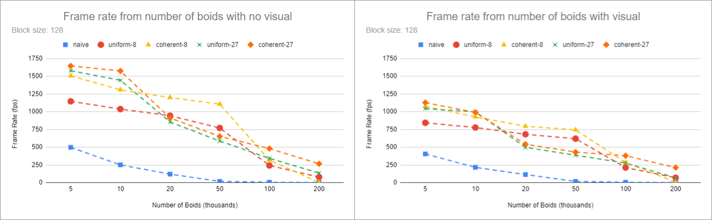

# Project 1 - Flocking

**University of Pennsylvania, CIS 565: GPU Programming and Architecture,
Project 1 - Flocking**

* Klayton Wittler
	* [LinkedIn](https://www.linkedin.com/in/klayton-wittler/)
* Tested on: Windows 10 Pro, i7-7700K @ 4.20GHz 16.0GB, GTX 1070 8.192GB (my PC)
______

* [Introduction](#introduction-to-boid-flocking)
	* [Rules](#rules)
	* [Approaches](#approaches)
* [Performance Analaysis](#performance-analysis)
* [Addition Optimization](#additional-optimization)


# Introduction to Boid Flocking
This project implements Reynolds Boids algorithm using CUDA kernels along with several layers of neighbor search optimization: uniform grid and uniform grid with coherent memory access. 


## Rules
The algorithm follows three rules for simulating boid flocking

1. cohesion - boids move towards the perceived center of mass of their neighbors
2. separation - boids avoid getting to close to their neighbors
3. alignment - boids generally try to move with the same direction and speed as their neighbors

Psuedocode for the algorithm goes as follows.
```
function velocityChange(Boid boid)
	vector cohesive_velocity = 0
	vector avoidance_velocity = 0
    vector alignement_velocity = 0

    float cohesive_neighbors = 0
    float alignment_neighbors = 0

    for each Boid b to check
        if b != boid then
        	if distance(b, boid) < rule1Distance then
            	cohesive_velocity += b.position
            	++cohesive_neighbors
        	end
        	if distance(b, boid) < rule2Distance then
            	avoidance_velocity += (boid.position - b.position)
        	end
        	if distance(b, boid) < rule3Distance then
            	alignement_velocity += b.velocity
            	++alignment_neighbors
            end
        end
    end

    if cohesive_neighbors > 0
    	cohesive_velocity /= cohesive_neighbors
    else
    	cohesive_velocity = boid.position
    endif
    if alignment_neighbors > 0
    	alignement_velocity /= alignment_neighbors
    endif

    vector rule1Change = (cohesive_velocity - boid.position) * rule1Scale
    vector rule2Change = avoidance_velocity * rule2Scale
    vector rule3Change = alignement_velocity * rule3Scale

	return rule1Change + rule2Change + rule3Change
end
```

## Approaches
Each boid must search around itself and compute its velocity change depending on the boids that fall within each of the rule distances.

### Naive
The naive approach is for each boid to compare itself to everyother boid. This quickly gets computationally expensive as will be seen the [Performance Analysis](#performance-analysis) section.


### Uniform Grid
To speed up the search we can take advantage of a uniform spatial grid data structure. As seen in 2D below, the environment is divided into cells which each boid will be binned into during a preprocess step.


In order to narrow the search we can just find the cells with a boids search radius and compare to each boid within those cells. For the 2D case where the cell width is twice the maximum rule distance, we just have to search 4 cells and in 3D this would be 8 cells.


To keep track of cell membership we use an array of pointers that can be sorted on the key of grid cell index and the start and end of each cell in the array marked with pointers.


### Coherent Memory
We can further optimize this by also sorting the array that contains the position and velocity information to be coherent in memory so that as we look into a cell all its members are within some area.


# Performance Analysis





## Questions
* For each implementation, how does changing the number of boids affect
performance? Why do you think this is?
* For each implementation, how does changing the block count and block size
affect performance? Why do you think this is?
* For the coherent uniform grid: did you experience any performance improvements
with the more coherent uniform grid? Was this the outcome you expected?
Why or why not?
* Did changing cell width and checking 27 vs 8 neighboring cells affect performance?
Why or why not? Be careful: it is insufficient (and possibly incorrect) to say
that 27-cell is slower simply because there are more cells to check!

# Additional Optimization


